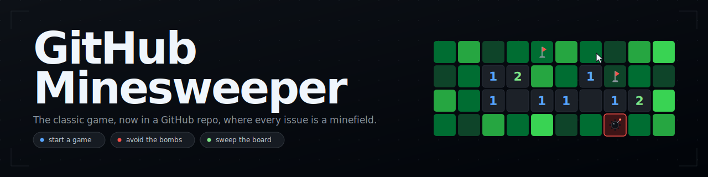
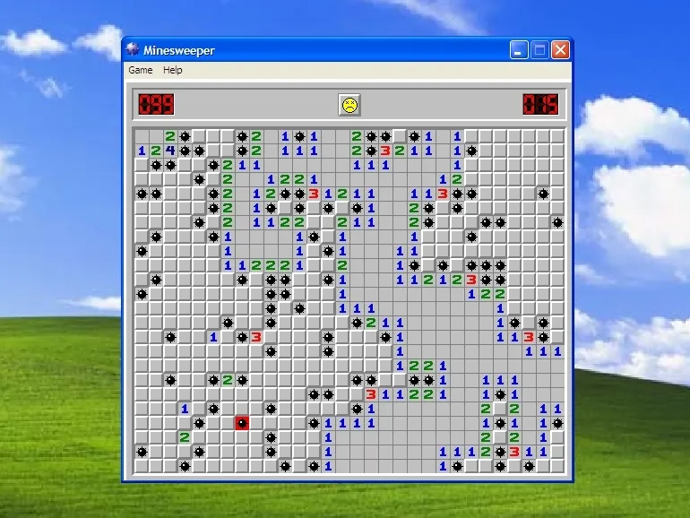
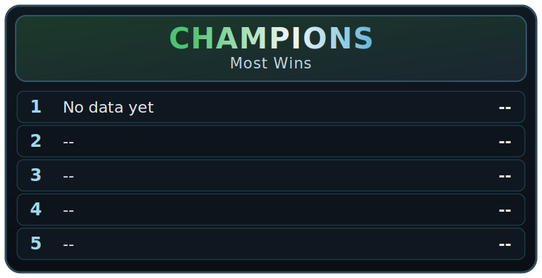
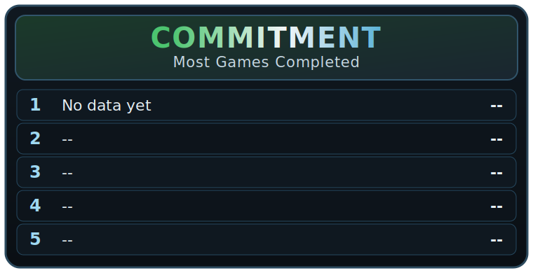
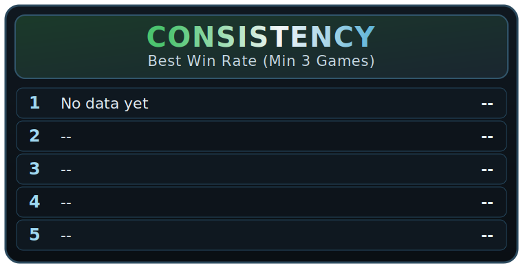

<picture>
  <source media="(prefers-color-scheme: dark)" srcset="media/minesweeper-banner-dark.svg" />
  <source media="(prefers-color-scheme:light)" srcset="media/minesweeper-banner-light.svg" />
  
</picture>

# Welcome to **GitHub Minesweeper!**<sup>*</sup><br>
<sub>*This repo is not associated with Microsoft, who owns the famous implementation we're most familiar with - and who also happens to own GitHub, who is also not affiliated with this repository.</sub>

<h1 align="center"><a href="https://github.com/hesreallyhim/github-minesweeper/issues/new?template=minesweeper-room.yml">START A NEW GAME</a></h1>

## Start A Game

<details>
<summary>How to start a game</summary>

1. Gameplay takes place inside GitHub Issues. Start a new issue by clicking [HERE](https://github.com/hesreallyhim/github-minesweeper/issues/new?template=minesweeper-room.yml)<br>(or, go to **Issues** -> **New issue** -> **Minesweeper Room**)

2. After having read the [CODE OF CONDUCT](.github/CODE_OF_CONDUCT.md) at least once, tick the box, then click <kbd>SUBMIT</kbd>.

3. **That's it!** That issue is now your personal Minesweeper game. Wait for the Minesweeper-Bot to set up your game, then submit moves by commenting in the thread. The Bot is usually pretty responsive - but it is very busy, so don't spam your own game (or anyone else's).
</details>

## What's "Minesweeper"?

<details>
<summary>If you grew up with Windows XP, you can probably skip this part</summary>

<br>

It's this thing:

<picture></picture>

Minesweeper is a classic computer game. Like all great games, it's about a situation that we can all relate to: going through a grid of tiles and trying to identify the location of hidden explosive devices on the basis of numerical hints, while trying to avoid getting blown up. You could call it a "slice of life" game I suppose.

### Gameplay

You start with a 9x9 grid of empty cells. One by one, you select a cell in order to reveal what's underneath. There's three outcomes:

(i) The cell reveals a number - that number indicates *how many cells that touch that cell have a mine in them*. This is the information you use to figure out which cells in the grid have mines, and to clear the board.

(ii) The cell has no mines around it. It reveals the whole group of adjacent empty cells.

(iii) The cell has a mine in it. The mine explodes. That means you lost the game.

So the idea is to find some cells with *numbers*, and then use that information to deduce whether other cells do or do not have mines in them, and move through the whole gameboard until you've revealed every cell that is mine-free. (It hardly seems worth explaining because surely everyone has done this in real life, but anyway that's how it works.)

In order to keep track of things, once you figure out that a certain cell must contain a mine, you do what anyone would do in that situation, and stick a flag right on top of the place where the underground explosive that is set to trigger on pressure is lying. Simple, right? (Note that in this version of the game, flags are _notational only_ - they are "notes to self". You can still guess/reveal a cell after you've already flagged it, and you win by uncovering all the non-mined cells - not by flagging all the mined cells.)

</details>

## Command Format

<details>
<summary>Commands</summary>
 Play by commenting commands:

  - `A1` - or: `guess A1`, `reveal A1`, `/guess A1`, `/reveal A1` - reveal cell(s)
  - `flag H7` - flag suspected mine(s)
  - `unflag H7` - remove flag(s)
  - `giveup` - end the game

  Notes:
  - Commands are case-insensitive.
  - Bare coordinates with no preceding command will be interpreted as `guess` commands, e.g.:

    - `A1` <=> `guess A1`
    - `A1 A2` <=> `guess A1 A2`
    - `flag A1 A2` indicates `flag A1` and `flag A2`

  - Each line may contain one command but multiple cells, e.g.:
    `guess A1 A2 B1 C1`
  - Each comment may contain multiple commands on different lines, e.g.:
    ```
    A1 A2 B1
    flag B2 C5
    A8
    guess D10
    ```
  - Use one action per line.
  - Any unrecognized token invalidates the whole turn.
  - Slash prefixes are optional, if you like them, but totally unnecessary (for example, `/flag A1`).
  - You do not have to flag all mines in order to solve the game.
  - You win the game by uncovering all non-mined cells, not by flagging all the mines.
  - Flags are for notational purposes only - if you issue a `guess` command on a flagged cell, that cell will be revealed.
</details>

## Hall Of Fame

<!-- MS_LEADERBOARD_START -->
### Leaderboards
_Last checked (UTC): 2026-05-05T01:51:18+00:00 from 0 completed games_

(Leaderboards update every 15 minutes)

<table align="center">
  <tr>
    <td><picture></picture></td>
    <td><picture></picture></td>
  </tr>
  <tr>
    <td><picture></picture></td>
    <td><picture></picture></td>
  </tr>
</table>

<em>No completed games yet.</em>
<!-- MS_LEADERBOARD_END -->

## Repository Structure

The default branch `main` is treated as a public game "UI" surface, and contains only the minimal set of files necessary. To view the full source code, visit `develop`.

## Ground Rules

- Don't open more than one game at the same time.
- Don't comment on other people's issue threads.
- Don't comment excessively on your own issue thread - try to take turns with the bot.
- If the bot is not responding, it probably means the app is being rate-limited - just be patient, and if you don't get a response, please try again later.

These rules are necessary in order to keep the game available for everyone to enjoy. Users who repeatedly violate these rules will be given a single warning. If they continue to violate these rules, they will be banned from participating further. So have fun, play like a human being, and don't be a spoiler!

With love and respect.

Happy minesweeping.
