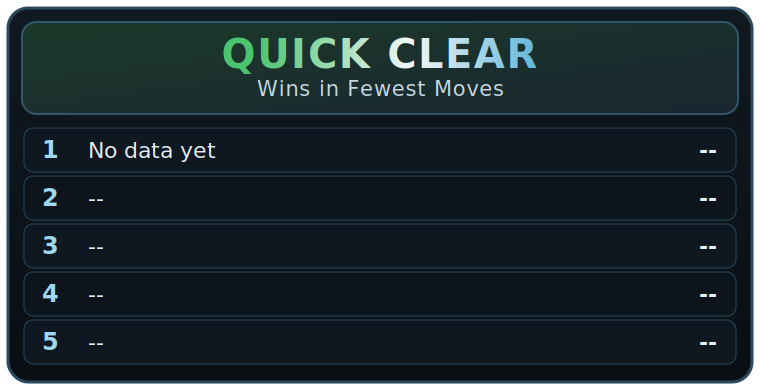

# GitHub Issue Minesweeper

A GitHub-native single-player Minesweeper game. Open an issue to start a
room, play by commenting commands, and see the board rendered directly in
bot replies.

Optionally, you can enable a click-relay mode where hidden cells render as
links and each click triggers a `repository_dispatch` move workflow.

## Quick Start

1. Go to **Issues** > **New issue** > select **Minesweeper Room**.
2. Submit the issue. The bot posts a fresh 9x9 table board:

```md
|   | A | B | C |
|---|---|---|---|
| 1 | `A1` | `B1` | `C1` |
| 2 | `A2` | `B2` | `C2` |
| 3 | `A3` | `B3` | `C3` |
```

3. Comment a command to play your turn:

```
/reveal B3
```

4. The bot replies with the updated board, stats, and game status:

```
### Minesweeper Room #1 — ⛏️ In Progress

Revealed **B3**.

|   | A | B | C |
|---|---|---|---|
| 1 | `A1` | **1** | `C1` |
| 2 | `A2` | · | `C2` |
| 3 | 🚩 | `B3` | `C3` |

Mines remaining: **10** | Cells revealed: **5/71**
```

5. Keep revealing cells until you win — or hit a mine!

### Optional Click-to-Reveal Mode

Set repository variables:

- `MINESWEEPER_CLICK_BASE_URL` — relay endpoint that accepts a signed `token`
- `MINESWEEPER_CLICK_TTL_SECONDS` (optional, default `120`)

When enabled, hidden cells render as clickable table links. The relay should:

1. Authenticate the GitHub user.
2. POST a `repository_dispatch` event of type `minesweeper-click` with:
   - `issue_number`
   - `click_token`
   - `actor`
   - `request_id` (optional idempotency key)

The workflow validates signature + expiry + sequence freshness before applying
the reveal.

## Commands

| Command           | Effect                                |
|-------------------|---------------------------------------|
| `/reveal B3`      | Reveal a cell                         |
| `/flag H7`        | Flag a suspected mine                 |
| `/unflag H7`      | Remove a flag                         |
| `/chord C4`       | Chord-reveal around a numbered cell   |
| `/giveup`         | End the game and reveal the board     |

Coordinates are spreadsheet-style: column letter (A-I) + row number
(1-9). Case doesn't matter — `b3` and `B3` both work.

## Board Symbols

| Symbol | Meaning              |
|--------|----------------------|
| `A1`   | Hidden cell (coordinate shown) |
| 🚩      | Flagged              |
| ·      | Revealed, no mines nearby |
| 1-8    | Adjacent mine count  |
| 💣      | Mine (shown on loss) |
| 💥      | Exploded mine        |

## Room Rules

- Only the issue opener can play in their room.
- One active game per player at a time.
- Commands from other users are politely rejected.
- Each command is processed exactly once (duplicate-safe).
- Reveal all safe cells to win. You don't need to flag every mine.

## Hall of Fame

<!-- MS_LEADERBOARD_START -->
### Leaderboards
_As of (UTC): n/a from 0 completed games_
(Leaderboards update every 15 minutes)

<table align="center">
  <tr>
    <td><picture></picture></td>
    <td><picture></picture></td>
  </tr>
  <tr>
    <td><picture></picture></td>
    <td><picture></picture></td>
  </tr>
</table>

<em>No completed games yet.</em>
<!-- MS_LEADERBOARD_END -->

## Project Structure

```
src/minesweeper/       # Game engine, state, commands, rendering
tests/                 # Unit tests and fixture-driven tests
tests/fixtures/github/ # Replayable GitHub event payloads
data/games/            # Terminal game records for leaderboard generation
data/leaderboards.json # Machine-readable leaderboard summary
assets/                # Generated README leaderboard card SVGs
.github/workflows/     # GitHub Actions for room lifecycle
.github/ISSUE_TEMPLATE/# Issue template for starting a room
scripts/               # Local development and replay tools
docs/                  # Gameplay guide and operator notes
```

## Local Development

```bash
# Set up the virtual environment and install dependencies
make bootstrap

# Run the test suite
make test

# Run lint checks
make lint

# Rebuild leaderboard cards + JSON + README block
make leaderboard-build

# Build the Docker image
make docker-build
```

## Documentation

- [Gameplay Guide](docs/gameplay.md) — how to play
- [Operator Notes](docs/operator-notes.md) — deployment and operations
- [Click Relay Contract](docs/click-relay-contract.md) — dispatch payload and validation rules
- [V1 Game Contract](docs/v1-game-contract.md) — implementation contract

## Design

The interaction model is inspired by
[github-mastermind](https://github.com/github-mastermind), adapted for
Minesweeper:

- Issue rooms as the board surface
- Comment commands as moves
- Hidden signed state preserves game integrity
- Authored bot comments provide the feedback loop

Game state is carried as a signed HMAC-SHA256 token embedded in an HTML
comment within bot replies, ensuring the mine layout stays hidden and
tamper-proof.
